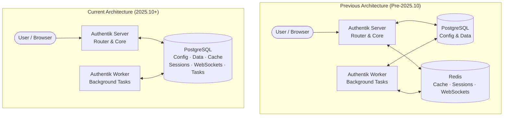

# Case Study: Authentik Removed Redis

Sometimes simplicity wins over performance.

**Lesson**: Redis adds operational complexity. Only add it when the performance gain justifies it.

<!--
- Authentik is an open-source Identity Provider
- They removed Redis to simplify deployment (fewer containers to manage)
- PostgreSQL LISTEN/NOTIFY replaced Pub/Sub; pg cache replaced Redis cache
- Tradeoff: slightly higher latency, much simpler ops
-->
