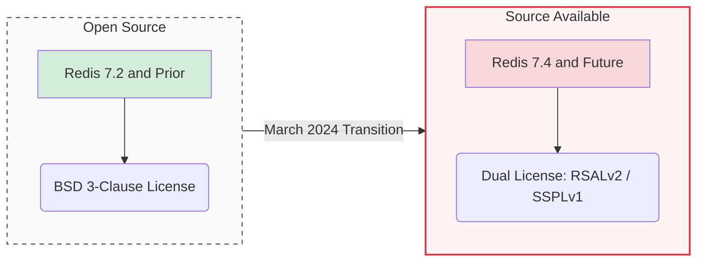

# License Shift: March 2024

Sources: [redis.io/blog/what-redis-license-change-means-for-our-managed-service-providers](https://redis.io/blog/what-redis-license-change-means-for-our-managed-service-providers/) · [redis.io/blog/agplv3](https://redis.io/blog/agplv3/)

<!--
- RSALv2 = Redis Source Available License v2: can use but can't sell Redis as a service
- SSPLv1 = Server Side Public License: open source but requires sharing all service code
- Drove community forks: Valkey (Linux Foundation), AWS ElastiCache switch to Valkey
-->
