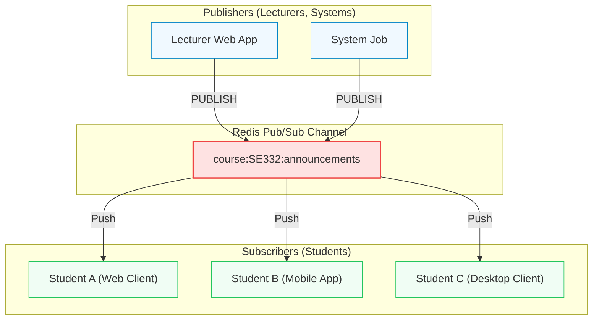

## Pub/Sub — Fire-and-Forget Messaging

Push-based real-time messaging. Publishers and subscribers are completely decoupled.

::left::

### Core Concepts

- **Push-based:** Messages instantly pushed to all active subscribers.
- **Decoupled:** Publishers and subscribers do not know each other.
- **Channels:** Subscriptions are bound to named channels.

### Fire-and-Forget

- **No Persistence:** Messages are **never stored** in memory/disk.
- **Offline Risk:** Offline subscribers **miss the event forever**.

::right::

<div class="scale-80 origin-top-left -mt-4">



</div>

<!--
Bây giờ chúng ta sẽ chuyển sang một cơ chế truyền tin vô cùng đặc biệt trong Redis: Pub/Sub, viết tắt của Publish/Subscribe. Đây là mô hình truyền tin theo cơ chế Push-based (đẩy dữ liệu), giúp tách biệt hoàn toàn (decouple) giữa bên gửi (Publisher) và bên nhận (Subscriber).

Publisher khi gửi một thông điệp sẽ chỉ đơn giản là bắn tin nhắn đó vào một "Channel" (kênh truyền). Họ hoàn toàn không cần biết và không cần quan tâm có bao nhiêu người đang lắng nghe kênh đó. Ngược lại, người nhận chỉ cần SUBSCRIBE vào kênh, và bất cứ khi nào có tin nhắn mới, Redis sẽ lập tức đẩy (push) về cho họ theo thời gian thực với độ trễ cực thấp.

Tuy nhiên, đặc tính quan trọng nhất của Redis Pub/Sub là "Fire-and-Forget" (bắn và quên) và hoàn toàn không có tính bền vững (No Persistence). Tin nhắn sau khi được publish sẽ được phân phối ngay lập tức tới các subscriber đang online rồi biến mất khỏi bộ nhớ Redis, không hề lưu trữ lại ở bất kỳ đâu. 

Nếu một subscriber đang offline tại thời điểm publish tin nhắn, họ sẽ bỏ lỡ thông báo đó mãi mãi. Vì vậy, Pub/Sub chỉ phù hợp cho các sự kiện tức thời, không yêu cầu tính bền vững cao, ví dụ như chat trực tuyến, hoặc cập nhật chỉ số live dashboard.
-->

---
hideInToc: true
layout: figure-side
figureUrl: https://raw.githubusercontent.com/socketio/socket.io-redis-adapter/main/assets/adapter.png
figureCaption: Socket.IO horizontal scaling via Redis Pub/Sub
figureX: r
---

## Real-world Scaling: WebSockets

Using Redis Pub/Sub to scale Socket.IO horizontally across multiple backend nodes.

- **The Problem:** WebSockets are stateful. A client on Server A cannot directly receive messages from Server B.
- **The Solution:** Redis Pub/Sub acts as an ultra-fast, lightweight shared event bus between servers.
- **How it works:** Server A publishes to Redis → Redis fans out to Server B and C → each server pushes to its own clients.

<!--
Để hình dung rõ hơn sức mạnh của Pub/Sub trong thực tế, chúng ta hãy xem xét bài toán: Mở rộng hệ thống WebSockets theo chiều ngang (horizontal scaling).

Khi lượng người dùng ứng dụng chat tăng lên, một máy chủ WebSocket đơn lẻ không thể chịu tải nổi, buộc ta phải chạy song song nhiều máy chủ đứng sau một Load Balancer. Tuy nhiên, WebSocket lại là kết nối có trạng thái (stateful). Khi Sinh viên A kết nối tới Server 1 và Sinh viên B kết nối tới Server 2, làm sao để Sinh viên A gửi tin nhắn cho Sinh viên B? Server 1 không thể trực tiếp gửi tin tới socket đang duy trì bởi Server 2.

Đây chính là lúc Redis Pub/Sub tỏa sáng như một "cầu nối" chia sẻ sự kiện (event bus). Khi Server 1 nhận tin nhắn từ Sinh viên A, nó sẽ PUBLISH tin nhắn lên một channel chung của Redis. Do tất cả các máy chủ WebSocket đều đang SUBSCRIBE kênh này, họ sẽ nhận được tin nhắn đó đồng thời và tức thì. Server 2 nhận được tin từ Redis, lập tức đẩy xuống cho Sinh viên B qua socket kết nối trực tiếp của mình.
-->

---
hideInToc: true
---

## Pub/Sub — Practical Commands

```bash
# Connection 1 (Student: Listening to SE332 course announcements)
SUBSCRIBE course:SE332.Q21:announcements
# Output: Reading messages... (waiting in subscriber mode)

# Connection 2 (Lecturer: Publishing a deadline alert)
PUBLISH course:SE332.Q21:announcements "Assignment 3 deadline: 2026-03-15 23:59"
# Output: (integer) 2  <-- Number of active subscribers who received this

# Connection 1 receives the message in real-time:
# 1) "message"
# 2) "course:SE332.Q21:announcements"
# 3) "Assignment 3 deadline: 2026-03-15 23:59"

# Connection 3 (Admin: Monitoring all course announcements with wildcards)
PSUBSCRIBE course:*:announcements
```

> **Key Constraint:** Once a connection runs `SUBSCRIBE`, it enters *subscriber mode* — it can only run subscription commands. Use a **separate connection** to `PUBLISH` or query the DB.

<!--
Hãy cùng nhìn vào các lệnh thực tế của Pub/Sub ở tầng terminal để hiểu cách hoạt động.

Ở cửa sổ kết nối thứ nhất, client thực hiện SUBSCRIBE vào kênh `course:SE332.Q21:announcements`. Ngay khi lệnh này chạy, connection đó sẽ chuyển sang chế độ "lắng nghe" và bị chặn (blocked), không thể gõ các lệnh đọc ghi thông thường như GET/SET được nữa.

Ở cửa sổ thứ hai, publisher phát thông báo bằng lệnh `PUBLISH course:SE332.Q21:announcements "Assignment 3 deadline..."`. Redis sẽ trả về một số nguyên biểu thị số lượng subscriber đang online nhận được tin nhắn. Ngay lập tức, cửa sổ thứ nhất sẽ tự động nhận và in ra thông điệp gồm: loại tin nhắn, tên kênh, và nội dung tin nhắn.

Ngoài ra, ta có thể dùng lệnh `PSUBSCRIBE` (Pattern Subscribe) với ký tự đại diện wildcard `*` để lắng nghe theo nhóm kênh, rất hữu ích cho các hệ thống giám sát. Lưu ý kỹ thuật quan trọng: khi connection đã chạy SUBSCRIBE, nó sẽ bị khóa vào chế độ nhận tin, bắt buộc ứng dụng phải mở một kết nối riêng biệt khác để thực hiện lệnh PUBLISH hoặc truy vấn dữ liệu.
-->
