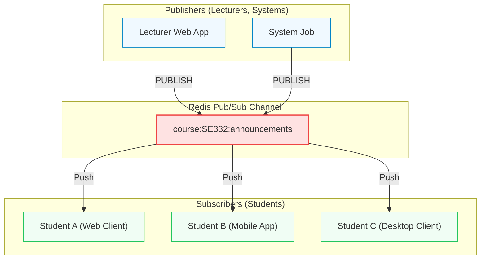

## Pub/Sub — Fire-and-Forget Messaging

Push-based real-time messaging. Publishers and subscribers are completely decoupled.

::left::

### Core Concepts

- **Push-based:** Messages instantly pushed to all active subscribers.
- **Decoupled:** Publishers and subscribers do not know each other.
- **Channels:** Subscriptions are bound to named channels.

### Fire-and-Forget

- **No Persistence:** Messages are **never stored** in memory/disk.
- **Offline Risk:** Offline subscribers **miss the event forever**.

::right::

<div class="scale-80 origin-top-left -mt-4">



</div>

<!--
Tiếp theo là Pub/Sub (Publish/Subscribe), cơ chế truyền tin Push-based giúp tách biệt hoàn toàn (decouple) bên gửi và bên nhận.

Publisher chỉ cần bắn tin nhắn vào "Channel". Subscriber cứ lắng nghe channel đó, có tin mới Redis sẽ lập tức đẩy (push) về theo thời gian thực.

Đặc tính quan trọng nhất là "Fire-and-Forget" (bắn và quên) và hoàn toàn không lưu trữ (No Persistence). Tin nhắn được gửi đến người đang online rồi biến mất ngay. Ai offline sẽ lỡ thông báo mãi mãi. Vì thế Pub/Sub hợp nhất cho chat live, thông báo tức thì, hoặc live dashboard.
-->

---
hideInToc: true
layout: figure-side
figureUrl: https://raw.githubusercontent.com/socketio/socket.io-redis-adapter/main/assets/adapter.png
figureCaption: Socket.IO horizontal scaling via Redis Pub/Sub
figureX: r
---

## Real-world Scaling: WebSockets

Using Redis Pub/Sub to scale Socket.IO horizontally across multiple backend nodes.

- **The Problem:** WebSockets are stateful. A client on Server A cannot directly receive messages from Server B.
- **The Solution:** Redis Pub/Sub acts as an ultra-fast, lightweight shared event bus between servers.
- **How it works:** Server A publishes to Redis → Redis fans out to Server B and C → each server pushes to its own clients.

<!--
Để hình dung rõ hơn sức mạnh của Pub/Sub trong thực tế, chúng ta hãy xem xét bài toán: Mở rộng hệ thống WebSockets theo chiều ngang (horizontal scaling).

Khi lượng người dùng ứng dụng chat tăng lên, một máy chủ WebSocket đơn lẻ không thể chịu tải nổi, buộc ta phải chạy song song nhiều máy chủ đứng sau một Load Balancer. Tuy nhiên, WebSocket lại là kết nối có trạng thái (stateful). Nếu một client trên Server A muốn gửi tin nhắn cho một client trên Server B, làm sao làm được việc đó khi Server A không hề giữ kết nối trực tiếp với client của Server B?

Đây chính là lúc Redis Pub/Sub tỏa sáng như một "cầu nối" chia sẻ sự kiện (shared event bus) cực kỳ gọn nhẹ giữa các máy chủ. 
Cách hoạt động rất đơn giản: Khi Server A nhận tin nhắn từ client của mình, nó sẽ PUBLISH tin nhắn đó lên Redis. Redis sau đó sẽ fan-out (phát tán) tin nhắn này tới tất cả các máy chủ khác (như Server B và Server C) nhờ việc các máy chủ này đều SUBSCRIBE vào kênh chung của Redis. Khi Server B nhận được tin nhắn từ Redis, nó sẽ lập tức đẩy (push) xuống cho các client đang kết nối trực tiếp với nó theo thời gian thực.
-->

---
hideInToc: true
---

## Pub/Sub — Practical Commands

```bash
# Connection 1 (Student: Listening to SE332 course announcements)
SUBSCRIBE course:SE332.Q21:announcements
# Output: Reading messages... (waiting in subscriber mode)

# Connection 2 (Lecturer: Publishing a deadline alert)
PUBLISH course:SE332.Q21:announcements "Assignment 3 deadline: 2026-03-15 23:59"
# Output: (integer) 2  <-- Number of active subscribers who received this

# Connection 1 receives the message in real-time:
# 1) "message"
# 2) "course:SE332.Q21:announcements"
# 3) "Assignment 3 deadline: 2026-03-15 23:59"

# Connection 3 (Admin: Monitoring all course announcements with wildcards)
PSUBSCRIBE course:*:announcements
```

> **Key Constraint:** Once a connection runs `SUBSCRIBE`, it enters *subscriber mode* — it can only run subscription commands. Use a **separate connection** to `PUBLISH` or query the DB.

<!--
Thực hành các lệnh Pub/Sub:

1. Lệnh `SUBSCRIBE` để lắng nghe kênh. Lưu ý: Khi chạy lệnh này, kết nối chuyển sang chế độ lắng nghe (blocked), không thể gọi GET/SET được nữa.
2. Lệnh `PUBLISH` để phát tin. Redis trả về số lượng người đang online nhận được tin. Những ai đang SUBSCRIBE lập tức nhận thông điệp.
3. Lệnh `PSUBSCRIBE` với dấu `*` để nghe nhiều kênh cùng lúc (Rất tốt cho hệ thống giám sát).

Lưu ý kỹ thuật quan trọng: Khi đã SUBSCRIBE, kết nối bị khóa. Bắt buộc phải mở một kết nối (connection) riêng biệt khác để gọi PUBLISH hoặc làm việc với DB.
-->
