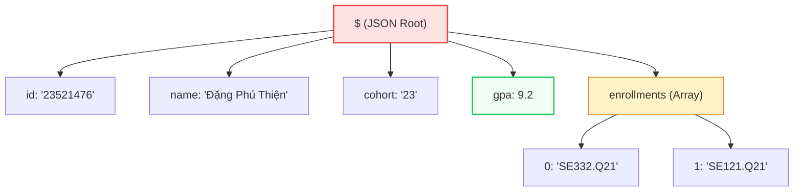

## RedisJSON — Native JSON Documents

Store, query, and atomically update nested JSON documents natively in memory.

::left::

### String JSON (Anti-Pattern)

<div class="bg-red-50 border border-red-300 rounded-lg p-4 text-sm">

To update a single nested field (e.g. GPA):

1. **GET** entire string over network.
2. **Deserialize** JSON in application.
3. **Modify** GPA in-memory.
4. **Re-serialize** back to string.
5. **SET** string back to Redis.

*Drawbacks: High network & CPU overhead, race conditions.*

</div>

::right::

### Native RedisJSON

<div class="bg-green-50 border border-green-300 rounded-lg p-4 text-sm">

To update GPA directly:

```sh
JSON.SET student:23521476 $.gpa 9.3
```

- **Binary Tree in RAM:** No full serialization/deserialization overhead.
- **Single Operation:** Zero extra network round-trips.
- **Atomic & Thread-Safe:** Safe native field modifications.

</div>

<!--
Chúng ta cùng bước sang một Module cực kỳ đột phá của Redis: RedisJSON. Trước đây, để lưu trữ JSON phức tạp, lập trình viên thường tuần tự hóa (serialize) thành chuỗi rồi lưu vào kiểu dữ liệu String thông thường.

Tuy nhiên, đây là một Anti-Pattern tai hại khi tài liệu lớn hoặc cần cập nhật thường xuyên. Ví dụ, để cập nhật điểm GPA từ 9.2 lên 9.3 của sinh viên Phú Thiện, ứng dụng phải: GET toàn bộ chuỗi JSON về, giải tuần tự hóa (deserialize) trong RAM ứng dụng, sửa đổi giá trị, sau đó serialize ngược lại và SET đè lên Redis. Quy trình cồng kềnh này gây hao tổn băng thông, tốn CPU và cực kỳ dễ xảy ra race conditions khi có nhiều client cùng cập nhật đồng thời.

Để giải quyết triệt để, RedisJSON cho phép thao tác trực tiếp trên bộ nhớ. Với lệnh `JSON.SET student:23521476 $.gpa 9.3`, ta chỉ định chính xác trường cần cập nhật qua đường dẫn JSONPath. Redis sẽ trực tiếp cập nhật giá trị đó trên cấu trúc cây nhị phân trong RAM mà không cần tải tài liệu qua mạng, loại bỏ hoàn toàn serialize/deserialize và đảm bảo an toàn luồng tuyệt đối nhờ cơ chế đơn luồng.
-->

---
hideInToc: true
layout: two-cols-header
layoutClass: gap-6
---

## RedisJSON — Native Document Model

Structured hierarchical document storage queryable via JSONPath syntax.

::left::

- **JSONPath:** Target specific fields using standard JSONPath (`$`, `$.gpa`, `$.enrollments[0]`).
- **Deep Nesting:** Supports full JSON specification — arrays, nested objects, strings, numbers.
- **Binary Format:** Native nested document format in RAM.

::right::

<div class="scale-80 origin-top-left -mt-4">



</div>

<!--
Để hiểu tại sao RedisJSON lại giải quyết triệt để bài toán hiệu năng, chúng ta hãy xem xét mô hình tài liệu nguyên bản (Native Document Model). Khi lưu trữ, Redis không lưu dưới dạng chuỗi phẳng mà tự động phân tích (parse) tài liệu thành một cây phân cấp nhị phân (binary hierarchical tree) ngay trong RAM.

Nhờ cấu trúc cây này, chúng ta có thể sử dụng cú pháp JSONPath tiêu chuẩn (như `$`, `$.gpa`, `$.enrollments[0]`) để trỏ thẳng đến bất kỳ nút nào và thực hiện đọc/ghi trực tiếp mà không cần deserialize toàn bộ tài liệu.

Hãy nhìn sơ đồ biểu diễn cây nhị phân ở bên phải. Nút gốc kí hiệu là `$`. Các thuộc tính phẳng như `id`, `name`, `cohort`, `gpa` nằm ở các nút con trực tiếp. Mảng `enrollments` chứa các chỉ mục môn học như `SE332.Q21` và `SE121.Q21`. Cấu trúc này giúp truy cập và sửa đổi phần tử con đạt tốc độ siêu tốc O(1) hoặc O(log N), mang lại hiệu năng vượt trội.
-->

---
hideInToc: true
---

## RedisJSON — Practical Commands

```bash
# 1. Store a complete student profile (root path '$')
JSON.SET student:23521476 $ '{"id":"23521476","username":"thiendp","name":"Đặng Phú Thiện","cohort":"23","gpa":9.2,"enrollments":["SE332.Q21","SE121.Q21"]}'

# 2. Retrieve only specific nested properties atomically
JSON.GET student:23521476 $.name $.gpa
# Output: {"$.name":["Đặng Phú Thiện"],"$.gpa":[9.2]}

# 3. Update the GPA field directly in-memory
JSON.SET student:23521476 $.gpa 9.3

# 4. Push a new course to the enrollments array atomically
JSON.ARRAPPEND student:23521476 $.enrollments '"SE113.Q11"'
# Output: (integer) 3   # (New length of the array)

# 5. Increment a numeric field natively inside the JSON tree
JSON.NUMINCRBY student:23521476 $.gpa 0.1
# Output: "[9.4]"
```

> **Thread-Safe & Atomic:** Because Redis is single-threaded, `JSON.ARRAPPEND` and `JSON.NUMINCRBY` are completely atomic — no need for `WATCH`/`MULTI`/`EXEC`.

<!--
Hãy cùng nhìn vào các câu lệnh thực tế của RedisJSON để thấy sự tiện lợi và sức mạnh của nó.

Đầu tiên, để lưu hồ sơ sinh viên vào nút gốc `$`, ta dùng lệnh `JSON.SET student:23521476 $` kèm chuỗi JSON để Redis phân tích thành cây nhị phân trong RAM. Khi truy vấn, thay vì lấy toàn bộ object, ta có thể lọc chính xác các trường cần thiết qua `JSON.GET student:23521476 $.name $.gpa` nhằm tiết kiệm tối đa băng thông.

Để cập nhật điểm số trực tiếp, ta dùng `JSON.SET student:23521476 $.gpa 9.3`. Khi sinh viên đăng ký thêm môn học, lệnh `JSON.ARRAPPEND student:23521476 $.enrollments '"SE113.Q11"'` sẽ tự động tìm tới nút mảng và thêm phần tử mới vào cuối. Chúng ta cũng có lệnh `JSON.NUMINCRBY` để tăng/giảm giá trị số một cách nguyên tử.

Tất cả các thao tác trên đều đảm bảo an toàn luồng (Thread-Safe) và nguyên tử (Atomic). Do cơ chế đơn luồng của Redis, các thao tác được thực thi tuần tự và cô lập hoàn toàn, loại bỏ nhu cầu sử dụng các cơ chế khóa phức tạp như WATCH hay MULTI/EXEC.
-->
