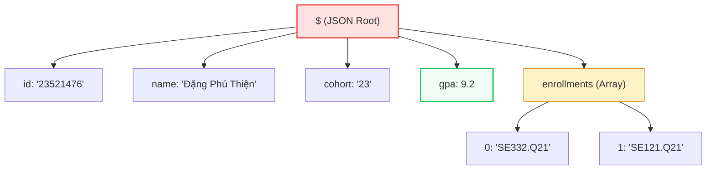

## RedisJSON — Native JSON Documents

Store, query, and atomically update nested JSON documents natively in memory.

::left::

### String JSON (Anti-Pattern)

<div class="bg-red-50 border border-red-300 rounded-lg p-4 text-sm">

To update a single nested field (e.g. GPA):

1. **GET** entire string over network.
2. **Deserialize** JSON in application.
3. **Modify** GPA in-memory.
4. **Re-serialize** back to string.
5. **SET** string back to Redis.

*Drawbacks: High network & CPU overhead, race conditions.*

</div>

::right::

### Native RedisJSON

<div class="bg-green-50 border border-green-300 rounded-lg p-4 text-sm">

To update GPA directly:

```sh
JSON.SET student:23521476 $.gpa 9.3
```

- **Binary Tree in RAM:** No full serialization/deserialization overhead.
- **Single Operation:** Zero extra network round-trips.
- **Atomic & Thread-Safe:** Safe native field modifications.

</div>

<!--
Tiếp theo là RedisJSON. Trước đây, lưu JSON vào Redis bằng String là một Anti-Pattern tai hại.

Ví dụ, để sửa GPA từ 9.2 lên 9.3, bạn phải GET toàn bộ chuỗi về, giải mã (deserialize), sửa, rồi đóng gói (serialize) lại và SET đè lên Redis. Cực kỳ tốn băng thông, CPU và dễ lỗi luồng (race conditions).

RedisJSON giải quyết triệt để: Dùng lệnh `JSON.SET ... $.gpa 9.3`, bạn cập nhật trực tiếp chính xác trường đó trên RAM. Bỏ qua hoàn toàn serialize/deserialize, tiết kiệm mạng và cực kỳ an toàn.
-->

---
hideInToc: true
layout: two-cols-header
layoutClass: gap-6
---

## RedisJSON — Native Document Model

Structured hierarchical document storage queryable via JSONPath syntax.

::left::

- **JSONPath:** Target specific fields using standard JSONPath (`$`, `$.gpa`, `$.enrollments[0]`).
- **Deep Nesting:** Supports full JSON specification — arrays, nested objects, strings, numbers.
- **Binary Format:** Native nested document format in RAM.

::right::

<div class="scale-80 origin-top-left -mt-4">



</div>

<!--
Bí quyết hiệu năng của RedisJSON là Native Document Model. Redis không lưu JSON thành chuỗi, mà phân tách thành cây phân cấp trực tiếp trên RAM.

Nhờ vậy, ta dùng cú pháp JSONPath (`$`, `$.gpa`, `$.enrollments[0]`) để trỏ và đọc/ghi trực tiếp vào một nút con (như sơ đồ bên phải) mà không cần load nguyên khối tài liệu lớn.

Tốc độ truy cập và cập nhật sâu bên trong cấu trúc cây siêu nhanh, đạt tới mức O(1) hoặc O(log N).
-->

---
hideInToc: true
---

## RedisJSON — Practical Commands

```bash
# 1. Store a complete student profile (root path '$')
JSON.SET student:23521476 $ '{"id":"23521476","username":"thiendp","name":"Đặng Phú Thiện","cohort":"23","gpa":9.2,"enrollments":["SE332.Q21","SE121.Q21"]}'

# 2. Retrieve only specific nested properties atomically
JSON.GET student:23521476 $.name $.gpa
# Output: {"$.name":["Đặng Phú Thiện"],"$.gpa":[9.2]}

# 3. Update the GPA field directly in-memory
JSON.SET student:23521476 $.gpa 9.3

# 4. Push a new course to the enrollments array atomically
JSON.ARRAPPEND student:23521476 $.enrollments '"SE113.Q11"'
# Output: (integer) 3   # (New length of the array)

# 5. Increment a numeric field natively inside the JSON tree
JSON.NUMINCRBY student:23521476 $.gpa 0.1
# Output: "[9.4]"
```

> **Thread-Safe & Atomic:** Because Redis is single-threaded, `JSON.ARRAPPEND` and `JSON.NUMINCRBY` are completely atomic — no need for `WATCH`/`MULTI`/`EXEC`.

<!--
Các lệnh thao tác thực tế:

1. Ghi toàn bộ dữ liệu vào nút gốc (`$`) bằng `JSON.SET`.
2. Truy vấn trích xuất đúng trường cần thiết bằng `JSON.GET ... $.name $.gpa` -> tiết kiệm băng thông.
3. Thay đổi giá trị mảng, ví dụ thêm môn học mới bằng `JSON.ARRAPPEND`.
4. Cộng/trừ toán học trên RAM với `JSON.NUMINCRBY`.

Đặc biệt: Nhờ kiến trúc đơn luồng của Redis, các thao tác này hoàn toàn nguyên tử (Atomic) và an toàn, không cần dùng các kỹ thuật khóa luồng (như WATCH hay MULTI).
-->
