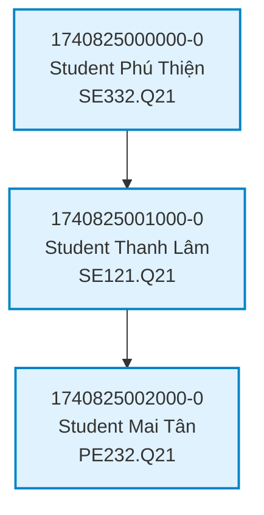
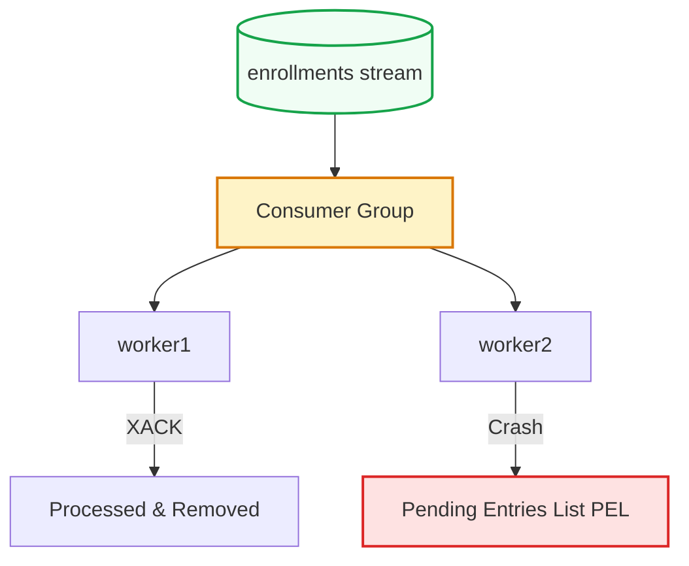

## Streams — Durable Event Log

An append-only, log-structured data type for high-throughput, persistent stream processing.

::left::

### Key Characteristics

- **Persistence:** Saved in RAM and serialized to disk (RDB/AOF) — survives crashes and restarts.
- **Strict Ordering:** Unique, time-sorted ID: `<timestamp>-<sequence>` (e.g. `1740825000000-0`).
- **Use Case:** Perfect for processing high-throughput sequences of events sequentially.

::right::

<div class="scale-80 origin-top-left -mt-2">



</div>

<!--
Để giải quyết nhược điểm mất tin nhắn của Pub/Sub, Redis 5.0 giới thiệu Streams - một nhật ký sự kiện dạng append-only (chỉ ghi nối tiếp).

Hai đặc tính cốt lõi:
1. Bền vững (Persistence): Dữ liệu lưu trong RAM nhưng được ghi xuống đĩa (RDB/AOF) nên không lo mất khi crash.
2. Thứ tự nghiêm ngặt (Strict Ordering): Mỗi event có ID dạng `timestamp-sequence`, đảm bảo thứ tự thời gian tuyệt đối.

Ví dụ đăng ký môn học: Mỗi lượt click là một Event độc lập đưa vào Stream (ai click trước xếp trước), giúp xử lý cực kỳ công bằng và không xảy ra tranh chấp.
-->

---
hideInToc: true
---

## Pub/Sub vs. Streams

A quick architectural decision matrix.

| Feature | Pub/Sub | Streams |
| :--- | :--- | :--- |
| **Persistence** | None (Transient) | **Yes (Durable on disk)** |
| **Delivery Model** | Push (Instant broadcast) | **Pull (Client fetches on-demand)** |
| **Data Retention** | Deleted instantly | **Kept until explicit deletion** |
| **History Replay** | No | **Yes (Range queries & replay)** |
| **Work Sharing** | Duplicate to all subscribers | **Consumer Groups (divide & conquer)** |
| **Primary Use Cases** | Real-time chat, alerts | **Task queues, Event Sourcing, Audit logs** |

<!--
Để dễ dàng đưa ra quyết định kiến trúc khi thiết kế hệ thống, hãy cùng so sánh nhanh Pub/Sub và Streams qua bảng đối chiếu gồm 6 đặc tính kỹ thuật cốt lõi này. Đây là phần kiến thức vô cùng quan trọng khi phỏng vấn hoặc thiết kế hệ thống thực tế.

Thứ nhất, về Bền vững (Persistence): Pub/Sub hoàn toàn không lưu trữ (bắn xong là mất), trong khi Streams lưu trữ bền vững trên cả RAM lẫn đĩa cứng.

Thứ hai, về Mô hình phân phối (Delivery Model): Pub/Sub sử dụng cơ chế Push — Redis chủ động đẩy tin nhắn cho client đang online. Ngược lại, Streams sử dụng cơ chế Pull — dữ liệu nằm im trong Stream, client chủ động kéo (fetch) về khi họ sẵn sàng, tránh bị quá tải.

Thứ ba, về Lưu giữ dữ liệu (Data Retention): Tin nhắn Pub/Sub bị xóa ngay lập tức sau khi gửi, còn trong Streams, dữ liệu được giữ lại vô thời hạn cho đến khi ta chủ động xóa.

Thứ tư, về Đọc lại lịch sử (History Replay): Pub/Sub không có tính năng này, còn Streams hỗ trợ tuyệt vời việc đọc lại sự kiện trong quá khứ nhờ cơ chế range query theo ID thời gian.

Thứ năm, về Chia sẻ công việc (Work Sharing): Pub/Sub nhân bản tin nhắn giống hệt nhau cho toàn bộ subscriber (mọi người cùng nhận một tin). Còn Streams hỗ trợ Consumer Groups chia việc cho các worker xử lý song song theo mô hình "divide & conquer".

Cuối cùng, về Ca sử dụng chính (Primary Use Cases): Pub/Sub hoàn hảo cho chat thời gian thực hoặc thông báo đẩy (alerts). Trong khi đó, Streams là lựa chọn tối ưu cho hàng đợi tác vụ (task queues), lưu vết sự kiện (Event Sourcing) và nhật ký kiểm toán (Audit logs).
-->

---
hideInToc: true
layout: two-cols-header
layoutClass: gap-6
---

## Streams — Consumer Groups

Scale processing horizontally across multiple parallel workers with guaranteed delivery.

::left::

- **Parallel Processing:** Distributes messages among registered workers — no message is processed twice.
- **Guaranteed Delivery:** Unacknowledged events go to the **Pending Entries List (PEL)**.
- **Fault Tolerance:** If `worker1` crashes, `worker2` can claim and reprocess its pending tasks.

::right::

<div class="scale-80 origin-top-left -mt-2">



</div>

<!--
Hãy cùng đi sâu vào tính năng mạnh mẽ nhất giúp Streams cạnh tranh sòng phẳng với các hệ thống Message Queue chuyên nghiệp như Kafka hay RabbitMQ: đó là Consumer Groups (Nhóm tiêu thụ).

Consumer Groups giúp giải quyết bài toán tải cao bằng cách gộp chung các worker để xử lý song song với 3 cơ chế cực kỳ quan trọng:

Thứ nhất, Parallel Processing (Xử lý song song): Redis sẽ tự động phân phối các tin nhắn khác nhau cho các worker đã đăng ký trong nhóm (như worker1 và worker2 ở sơ đồ). Điều này giúp tăng tốc độ xử lý và đảm bảo không có tin nhắn nào bị xử lý trùng lặp bởi hai worker khác nhau.

Thứ hai, Guaranteed Delivery (Đảm bảo phân phối): Khi một tin nhắn được phân phối cho worker, nó sẽ không biến mất ngay mà được đưa vào một danh sách đặc biệt gọi là Pending Entries List (PEL). Chỉ khi worker xử lý xong và gửi lệnh xác nhận XACK, tin nhắn mới được chính thức xóa bỏ.

Thứ ba, Fault Tolerance (Khả năng chịu lỗi): Dựa trên PEL, nếu worker1 nhận việc nhưng bị crash đột ngột giữa chừng, worker2 hoàn toàn có thể giành quyền sở hữu (claim) và xử lý lại các tác vụ đang bị treo đó. Điều này đem lại độ tin cậy tuyệt đối cho luồng đăng ký học của UIT.
-->

---
hideInToc: true
---

## Streams — Commands in Action

```bash
# 1. Log a new student enrollment request (XADD)
XADD enrollments * student_id "23521476" course_id "SE332.Q21" timestamp "2026-03-01T10:30:00Z"
# Output: "1740825000000-0" (auto-generated timestamp-sequence ID)

# 2. Query event logs within a range (XRANGE)
XRANGE enrollments - + COUNT 5

# 3. Create a Consumer Group (XGROUP)
XGROUP CREATE enrollments group_processors $ MKSTREAM

# 4. Workers pull fresh, unprocessed events from the group (XREADGROUP)
XREADGROUP GROUP group_processors worker1 COUNT 1 STREAMS enrollments >
# Output: student_id: "23521476", course_id: "SE332.Q21"

# 5. Acknowledge successful processing to clear from Pending List (XACK)
XACK enrollments group_processors 1740825000000-0
```

<!--
Các lệnh cơ bản của Streams:

1. Đẩy sự kiện mới (`XADD`): Dấu `*` để Redis tự sinh ID theo timestamp.
2. Truy vấn lịch sử (`XRANGE`): Dấu `-` và `+` đại diện cho ID nhỏ nhất và lớn nhất.
3. Tạo Consumer Group (`XGROUP CREATE`): Ký hiệu `$` báo hiệu nhóm chỉ xử lý các tin nhắn mới từ thời điểm này trở đi.
4. Worker kéo dữ liệu (`XREADGROUP`): Ký hiệu `>` nghĩa là lấy sự kiện mới nhất chưa từng giao cho ai.
5. Xác nhận xử lý (`XACK`): Bắt buộc gọi sau khi xử lý xong để giải phóng tin nhắn khỏi danh sách treo (PEL).
-->
