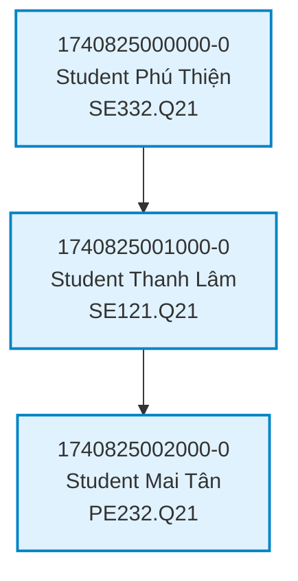
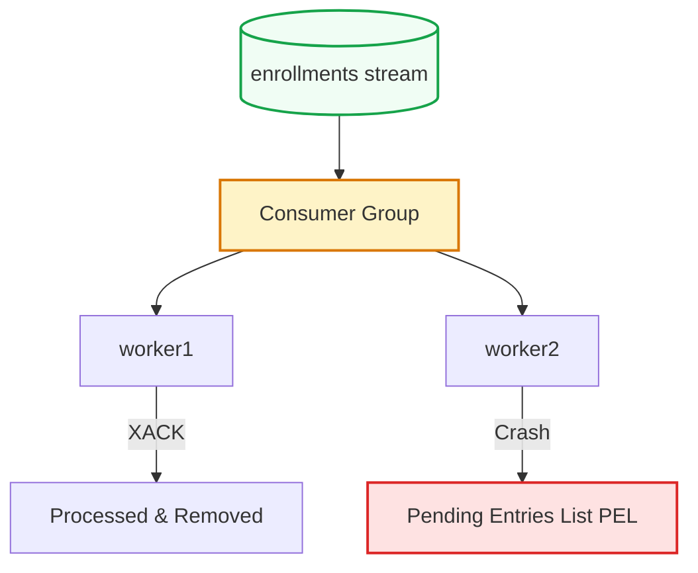

## Streams — Durable Event Log

An append-only, log-structured data type for high-throughput, persistent stream processing.

::left::

### Key Characteristics

- **Persistence:** Saved in RAM and serialized to disk (RDB/AOF) — survives crashes and restarts.
- **Strict Ordering:** Unique, time-sorted ID: `<timestamp>-<sequence>` (e.g. `1740825000000-0`).
- **Use Case:** Perfect for processing high-throughput sequences of events sequentially.

::right::

<div class="scale-80 origin-top-left -mt-2">



</div>

<!--
Chúng ta vừa đi qua Pub/Sub với nhược điểm chí mạng là "Fire-and-Forget". Để giải quyết triệt để vấn đề mất tin nhắn và xử lý luồng dữ liệu quy mô lớn, Redis đã giới thiệu cấu trúc dữ liệu Streams từ phiên bản 5.0. Đây là một nhật ký sự kiện dạng append-only (chỉ ghi thêm vào cuối) bền vững và lưu trữ trực tiếp trong RAM.

Đặc tính đầu tiên là tính Bền vững (Persistence) — dữ liệu lưu trữ trực tiếp trong RAM và được cấu hình ghi xuống đĩa qua RDB/AOF, giúp thông tin không bị mất mát khi máy chủ gặp sự cố hoặc restart.
Đặc tính thứ hai là tính Thứ tự nghiêm ngặt (Strict Ordering) với ID độc bản dạng `timestamp-sequence` được sinh tự động và tăng dần theo thời gian, đảm bảo thứ tự trước sau của các sự kiện luôn chính xác tuyệt đối.

Hãy nhìn vào sơ đồ bên phải minh họa kịch bản đăng ký môn học tại UIT. Mỗi lượt click đăng ký của sinh viên được ghi nhận (XADD) vào Stream như một Event độc lập theo thời gian (ai click trước sẽ xếp trước), giúp hệ thống xử lý cực kỳ công bằng và loại bỏ hoàn toàn tranh chấp.
-->

---
hideInToc: true
---

## Pub/Sub vs. Streams

A quick architectural decision matrix.

| Feature | Pub/Sub | Streams |
| :--- | :--- | :--- |
| **Persistence** | None (Transient) | **Yes (Durable on disk)** |
| **Delivery Model** | Push (Instant broadcast) | **Pull (Client fetches on-demand)** |
| **Data Retention** | Deleted instantly | **Kept until explicit deletion** |
| **History Replay** | No | **Yes (Range queries & replay)** |
| **Work Sharing** | Duplicate to all subscribers | **Consumer Groups (divide & conquer)** |
| **Primary Use Cases** | Real-time chat, alerts | **Task queues, Event Sourcing, Audit logs** |

<!--
Để dễ dàng đưa ra quyết định kiến trúc khi thiết kế hệ thống, hãy cùng so sánh nhanh Pub/Sub và Streams qua bảng đối chiếu này. Đây là phần kiến thức vô cùng quan trọng khi phỏng vấn hoặc thiết kế hệ thống thực tế.

Thứ nhất, về mặt Persistence: Pub/Sub hoàn toàn không lưu trữ (bắn xong là mất), trong khi Streams lưu trữ bền vững trên cả RAM lẫn đĩa cứng.

Thứ hai, về mô hình phân phối dữ liệu (Delivery Model): Pub/Sub sử dụng cơ chế Push — Redis chủ động đẩy tin nhắn cho client đang online. Còn Streams sử dụng cơ chế Pull — dữ liệu nằm im trong Stream, client chủ động kéo (fetch) dữ liệu về khi họ sẵn sàng, giúp tránh nghẽn (overwhelmed) khi lượng tin nhắn tăng đột biến.

Thứ ba, khả năng Replay (đọc lại lịch sử): Pub/Sub không thể làm được, còn Streams hỗ trợ tuyệt vời việc đọc lại một khoảng thời gian bất kỳ trong quá khứ nhờ cơ chế đánh chỉ mục theo ID thời gian.

Cuối cùng, về chia sẻ công việc (Work Sharing): Pub/Sub sẽ nhân bản và gửi tin nhắn giống hệt nhau cho toàn bộ subscriber. Còn Streams hỗ trợ cơ chế Consumer Groups — cho phép phân phối các sự kiện khác nhau cho các worker khác nhau xử lý song song, tránh việc một tác vụ bị xử lý trùng lặp.
-->

---
hideInToc: true
layout: two-cols-header
layoutClass: gap-6
---

## Streams — Consumer Groups

Scale processing horizontally across multiple parallel workers with guaranteed delivery.

::left::

- **Parallel Processing:** Distributes messages among registered workers — no message is processed twice.
- **Guaranteed Delivery:** Unacknowledged events go to the **Pending Entries List (PEL)**.
- **Fault Tolerance:** If `worker1` crashes, `worker2` can claim and reprocess its pending tasks.

::right::

<div class="scale-80 origin-top-left -mt-2">



</div>

<!--
Hãy cùng đi sâu vào tính năng mạnh mẽ nhất giúp Streams cạnh tranh sòng phẳng với các hệ thống Message Queue chuyên nghiệp như Kafka hay RabbitMQ: đó là Consumer Groups (Nhóm tiêu thụ).

Consumer Groups cho phép chúng ta gộp chung các Worker xử lý song song để giải quyết bài toán tải cao (ví dụ hàng ngàn sinh viên click đăng ký môn học cùng lúc). 
Hệ thống này mang lại hai lợi ích lớn:
1. Parallel Processing: Chia việc cho các worker khác nhau xử lý song song và đảm bảo không có tin nhắn nào bị xử lý trùng lặp.
2. Fault Tolerance: Sử dụng danh sách Pending Entries List (PEL) để giám sát các tin nhắn đang được xử lý. Chỉ khi worker gửi xác nhận (XACK), tin nhắn mới được xóa khỏi PEL. Nếu một worker bị crash đột ngột trước khi kịp xử lý, worker khác có thể giành lấy ("claim") để xử lý tiếp, mang lại độ tin cậy tuyệt đối cho luồng đăng ký học của UIT.
-->

---
hideInToc: true
---

## Streams — Commands in Action

```bash
# 1. Log a new student enrollment request (XADD)
XADD enrollments * student_id "23521476" course_id "SE332.Q21" timestamp "2026-03-01T10:30:00Z"
# Output: "1740825000000-0" (auto-generated timestamp-sequence ID)

# 2. Query event logs within a range (XRANGE)
XRANGE enrollments - + COUNT 5

# 3. Create a Consumer Group (XGROUP)
XGROUP CREATE enrollments group_processors $ MKSTREAM

# 4. Workers pull fresh, unprocessed events from the group (XREADGROUP)
XREADGROUP GROUP group_processors worker1 COUNT 1 STREAMS enrollments >
# Output: student_id: "23521476", course_id: "SE332.Q21"

# 5. Acknowledge successful processing to clear from Pending List (XACK)
XACK enrollments group_processors 1740825000000-0
```

<!--
Bây giờ, chúng ta hãy cùng thực hành các câu lệnh cơ bản của Streams trên terminal để xem luồng dữ liệu chạy như thế nào.

Đầu tiên, để đẩy một sự kiện mới vào stream `enrollments`, chúng ta sử dụng lệnh `XADD`. Dấu sao `*` báo hiệu cho Redis tự động sinh ID dựa trên timestamp hiện tại của hệ thống. Phía sau là các cặp key-value lưu trữ thông tin sự kiện.

Thứ hai, để truy vấn hoặc xem lại lịch sử các sự kiện trong một khoảng thời gian, chúng ta dùng lệnh `XRANGE`. Ở đây, dấu `-` đại diện cho ID nhỏ nhất có thể, dấu `+` đại diện cho ID lớn nhất có thể. Tham số `COUNT 5` giúp giới hạn lấy ra tối đa 5 sự kiện đầu tiên.

Thứ ba, để cấu hình phân chia công việc xử lý song song, chúng ta khởi tạo một Consumer Group bằng lệnh `XGROUP CREATE` với nhóm `group_processors` quản lý stream. Ký hiệu `$` chỉ định rằng nhóm này sẽ chỉ tiêu thụ các tin nhắn mới phát sinh từ thời điểm này trở đi.

Thứ tư, các Worker sẽ sử dụng lệnh `XREADGROUP` để kéo dữ liệu về xử lý. Ký hiệu `>` ở cuối có nghĩa là: "Hãy cho tôi sự kiện mới nhất chưa từng được phân phối cho bất kỳ ai trong nhóm này".

Cuối cùng, sau khi Worker xử lý thành công, nó bắt buộc phải chạy lệnh `XACK` kèm theo ID của sự kiện để giải phóng nó ra khỏi danh sách PEL, tránh tình trạng tin nhắn bị treo trong trạng thái chờ.
-->
