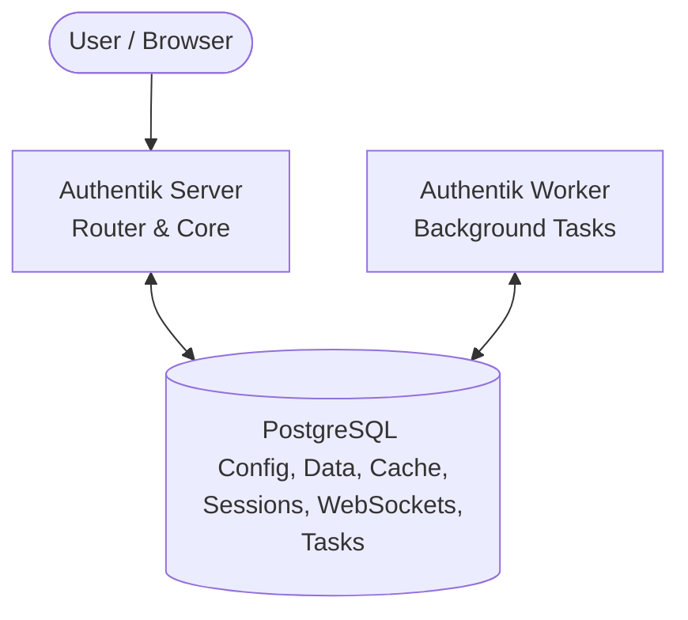

## Case Study: Authentik Removed Redis

**Before (Pre-2025.10)**

**After (2025.10+)**

**Lesson:** Redis adds operational complexity — only adopt when the performance gain justifies it

<!--
Authentik (open-source identity provider) removed Redis in favor of using PostgreSQL alone to reduce operational complexity.
The lesson: don't add infrastructure you don't need. Redis is powerful, but only when the use case warrants it.
-->
