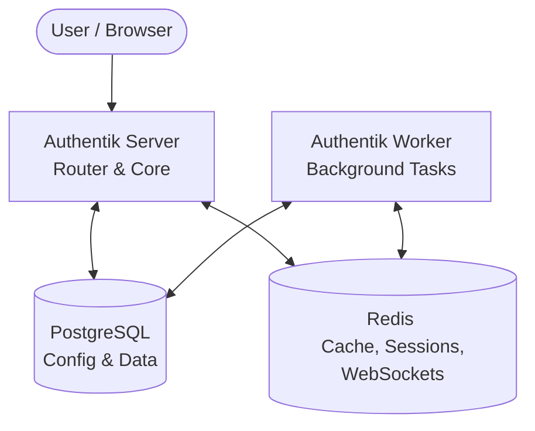

## Case Study: Authentik Removed Redis

**Before (Pre-2025.10)**

**After (2025.10+)**

**Lesson:** Redis adds operational complexity — only adopt when the performance gain justifies it

<!--
Authentik là một open-source identity provider (SSO/OAuth2).
Trước phiên bản 2025.10, Authentik dùng Redis cho cache, session, WebSocket.
Sau đó họ loại bỏ Redis hoàn toàn, chuyển hết sang PostgreSQL.

Tại sao? Redis làm tăng độ phức tạp vận hành:
phải quản lý thêm một service, cấu hình persistence, memory limits, v.v.
Với use case của Authentik, PostgreSQL đáp ứng đủ — không cần Redis.

Bài học: đừng thêm infrastructure nếu không thực sự cần.
Redis rất mạnh, nhưng chỉ nên dùng khi performance gain xứng đáng với chi phí vận hành.
-->
