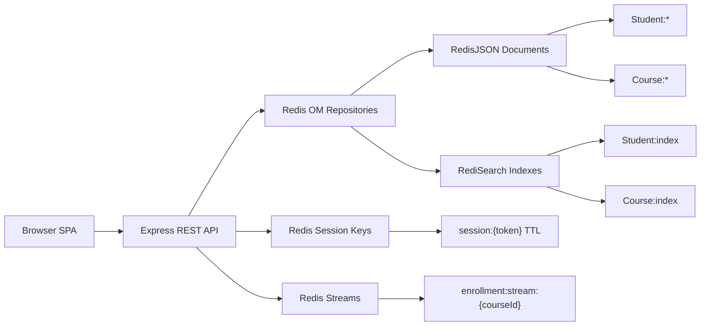

## UIT Course Manager Architecture

One Redis Stack instance powers documents, search, session state, and event logs.

<!--
Trình duyệt chỉ gọi REST API, không nói chuyện trực tiếp với Redis.
Express API là lớp xử lý nghiệp vụ, còn Redis OM giúp map Student và Course thành document trong RedisJSON.

Phần search nằm riêng ở RediSearch index, nên khi gõ tên sinh viên hoặc lọc môn học thì backend không phải scan từng JSON document.
Auth thì tạo `session:{token}` có TTL; logout chỉ cần xóa key đó.
Riêng enroll/unenroll ngoài việc cập nhật JSON còn ghi thêm Stream event, để có log lịch sử thao tác.
-->

---
hideInToc: true
---

## API Surface

| Flow | Endpoint | Redis commands |
| ---- | -------- | -------------- |
| Login / logout | `/auth/login`, `/auth/logout` | `SET EX`, `GET`, `DEL` |
| Profile | `/auth/me` | `JSON.GET`, `JSON.SET` |
| Student CRUD | `/students/:id` | `JSON.SET`, `JSON.GET`, `JSON.DEL` |
| Search | `/students/search`, `/courses/search` | `FT.SEARCH` |
| Enrollment | `/courses/:id/students` | `JSON.SET`, `XADD` |

OpenAPI spec: `slides/se332/openapi.yaml`

<!--
Mỗi flow trên UI đều map xuống một nhóm command Redis: login thì `SET EX`, profile thì `JSON.GET` và `JSON.SET`,
search thì `FT.SEARCH`, còn enrollment thì vừa `JSON.SET` vừa `XADD`.
-->
