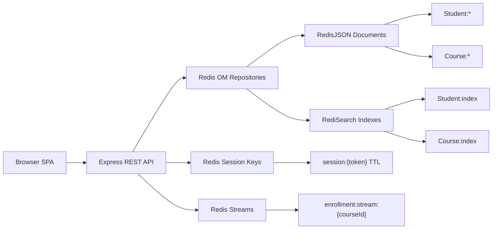

## UIT Course Manager Architecture

One Redis Stack instance powers documents, search, session state, and event logs.

<!--
- Giải thích luồng chính: frontend gọi Express API, API dùng Redis OM cho Student/Course.
- RedisJSON lưu document: Student:* và Course:*.
- RediSearch tạo index để search theo tên, username, lecturer, GPA.
- Login tạo key session:{token} có TTL; logout thì DEL key.
- Enroll/unenroll ghi thêm event vào Redis Stream để có audit log.
-->

---
hideInToc: true
---

## API Surface

| Flow | Endpoint | Redis commands |
| ---- | -------- | -------------- |
| Login / logout | `/auth/login`, `/auth/logout` | `SET EX`, `GET`, `DEL` |
| Profile | `/auth/me` | `JSON.GET`, `JSON.SET` |
| Student CRUD | `/students/:id` | `JSON.SET`, `JSON.GET`, `JSON.DEL` |
| Search | `/students/search`, `/courses/search` | `FT.SEARCH` |
| Enrollment | `/courses/:id/students` | `JSON.SET`, `XADD` |

OpenAPI spec: `slides/se332/openapi.yaml`

<!--
- Nói nhanh API map để giảng viên thấy demo có thiết kế backend rõ ràng, không chỉ là UI tĩnh.
- Khi demo, không cần mở hết endpoint; chỉ chọn các flow có ý nghĩa: login/session, edit profile, search, enrollment stream.
- Nhấn mạnh OpenAPI đã được cập nhật để mô tả thêm auth/profile.
-->
